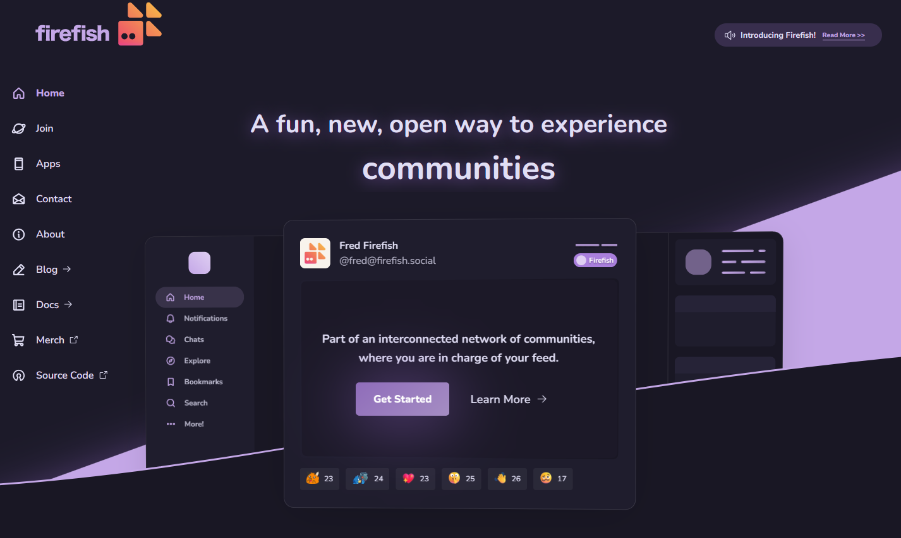

<!--
N.B.: Diese README wurde automatisch von <https://github.com/YunoHost/apps/tree/master/tools/readme_generator> generiert.
Sie darf NICHT von Hand bearbeitet werden.
-->

# Firefish für YunoHost

[](https://ci-apps.yunohost.org/ci/apps/firefish/)


[](https://install-app.yunohost.org/?app=firefish)

*[Dieses README in anderen Sprachen lesen.](./ALL_README.md)*

> *Mit diesem Paket können Sie Firefish schnell und einfach auf einem YunoHost-Server installieren.*  
> *Wenn Sie YunoHost nicht haben, lesen Sie bitte [die Anleitung](https://yunohost.org/install), um zu erfahren, wie Sie es installieren.*

## Übersicht


A greatly enhanced fork of Misskey with better UI/UX, security, features, and more!


    Firefish is based off of Misskey, a powerful microblogging server on ActivityPub with features such as emoji reactions, a customizable web UI, rich chatting, and much more!
    Firefish adds many quality of life changes and bug fixes for users and instance admins alike.

### ⚠️ PLEASE READ CAREFULLY ⚠️

**Firefish** requires **redis** version **7**, but YunoHost does not currently support this version.
Some functions will not be available if you install this package.

I advise you to wait for the release of _Bookworm_ Debian 12.

**Ausgelieferte Version:** 20241205~ynh1

**Demo:** <https://info.firefish.dev>

## Bildschirmfotos



## :red_circle: Anti-Eigenschaften

- **Upstream not maintained**: This software is not maintained anymore. Expect it to break down over time, be exposed to unfixed security breaches, etc.

## Dokumentation und Ressourcen

- Offizielle Website der App: <https://joinfirefish.org>
- Upstream App Repository: <https://firefish.dev/firefish/firefish>
- YunoHost-Shop: <https://apps.yunohost.org/app/firefish>
- Einen Fehler melden: <https://github.com/YunoHost-Apps/firefish_ynh/issues>

## Entwicklerinformationen

Bitte senden Sie Ihren Pull-Request an den [`testing` branch](https://github.com/YunoHost-Apps/firefish_ynh/tree/testing).

Um den `testing` Branch auszuprobieren, gehen Sie bitte wie folgt vor:

```bash
sudo yunohost app install https://github.com/YunoHost-Apps/firefish_ynh/tree/testing --debug
oder
sudo yunohost app upgrade firefish -u https://github.com/YunoHost-Apps/firefish_ynh/tree/testing --debug
```

**Weitere Informationen zur App-Paketierung:** <https://yunohost.org/packaging_apps>
