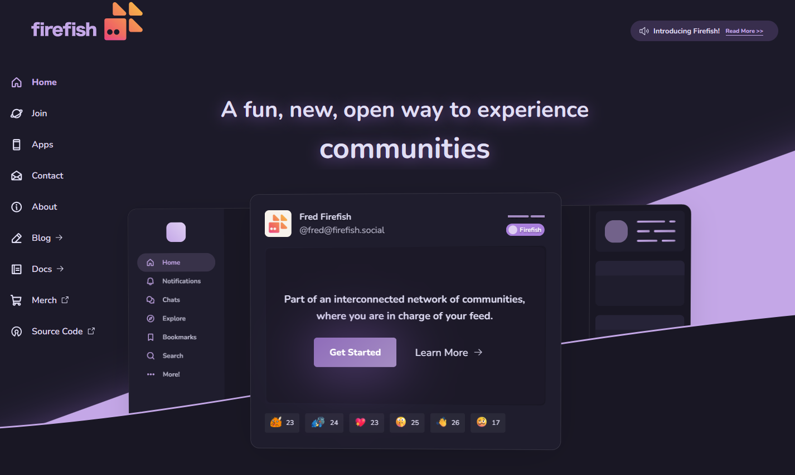

<!--
Ohart ongi: README hau automatikoki sortu da <https://github.com/YunoHost/apps/tree/master/tools/readme_generator>ri esker
EZ editatu eskuz.
-->

# Firefish YunoHost-erako

[](https://ci-apps.yunohost.org/ci/apps/firefish/)


[](https://install-app.yunohost.org/?app=firefish)

*[Irakurri README hau beste hizkuntzatan.](./ALL_README.md)*

> *Pakete honek Firefish YunoHost zerbitzari batean azkar eta zailtasunik gabe instalatzea ahalbidetzen dizu.*  
> *YunoHost ez baduzu, kontsultatu [gida](https://yunohost.org/install) nola instalatu ikasteko.*

## Aurreikuspena


A greatly enhanced fork of Misskey with better UI/UX, security, features, and more!


    Firefish is based off of Misskey, a powerful microblogging server on ActivityPub with features such as emoji reactions, a customizable web UI, rich chatting, and much more!
    Firefish adds many quality of life changes and bug fixes for users and instance admins alike.

### ⚠️ PLEASE READ CAREFULLY ⚠️

**Firefish** requires **redis** version **7**, but YunoHost does not currently support this version.
Some functions will not be available if you install this package.

I advise you to wait for the release of _Bookworm_ Debian 12.

**Paketatutako bertsioa:** 20241205~ynh2

**Demoa:** <https://info.firefish.dev>

## Pantaila-argazkiak



## Dokumentazioa eta baliabideak

- Aplikazioaren webgune ofiziala: <https://joinfirefish.org>
- Jatorrizko aplikazioaren kode-gordailua: <https://firefish.dev/firefish/firefish>
- YunoHost Denda: <https://apps.yunohost.org/app/firefish>
- Eman errore baten berri: <https://github.com/YunoHost-Apps/firefish_ynh/issues>

## Garatzaileentzako informazioa

Bidali `pull request`a [`testing` abarrera](https://github.com/YunoHost-Apps/firefish_ynh/tree/testing).

`testing` abarra probatzeko, ondorengoa egin:

```bash
sudo yunohost app install https://github.com/YunoHost-Apps/firefish_ynh/tree/testing --debug
edo
sudo yunohost app upgrade firefish -u https://github.com/YunoHost-Apps/firefish_ynh/tree/testing --debug
```

**Informazio gehiago aplikazioaren paketatzeari buruz:** <https://yunohost.org/packaging_apps>
